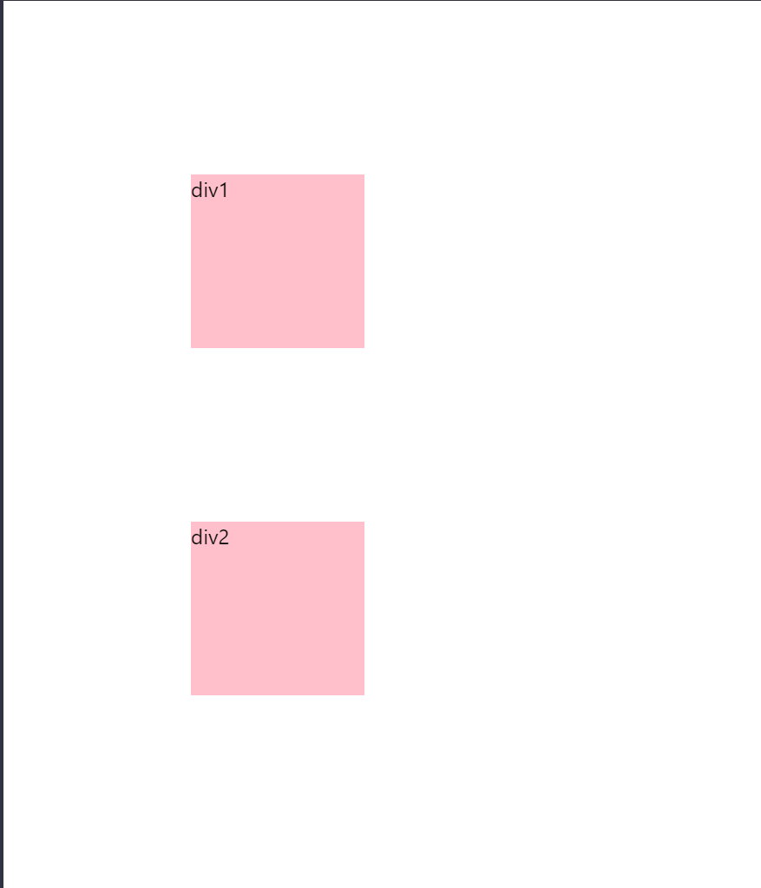

### 1. 介绍下 BFC 及其应用

#### 1. BFC 的概念

format context 格式化上下文，是w3c css2.1 规范中的一个概。它是页面中的一块渲染区域，有一套自己的渲染规则，决定了其子元素如何定位，以及如何和其他元素相互作用。

**BFC 即 block format context ，称为块级格式化上下文，具有 BFC 特性的元素可以认为是有隔离作用的容器，其内部子元素不会对外部元素产生影响，并且 BFC 元素本身也有一些独有的特点。**

#### 2 . 什么样的元素是 BFC 元素

那么，什么样的元素具有 BFC 属性呢？以下这些就是：

- body 根元素就是一个具有 BFC 属性的元素。
- 具有绝对定位多的元素，`display: absolue; display: fixed;`	。
- 浮动元素，也就是 `float` 不为 none 的原素。
- `overflow`不为 visible 的原色，如 hidden，auto ，scroll。
- `display: inline-block;display: flex;dispaly: table-cell`原素。

#### 3. 具有 BFC 特性的元素有什么特点以及能解决什么问题

##### 3.1 同一个 BFC 元素内部的元素上下外边距 margin 会发生塌陷

```html
<body>
	<div>
        div1
    </div>
    <div>
        div2
    </div>
</body>
```

```scss
div {
    width: 100px;
    height: 100px;
    background-color: pink;
    margin: 100px;
}
```

我们会发现，两个 `div` 元素上下之间的外间距并不是 200px，而是只有 100px， 这是因为 `body`本身是一个 BFC 元素，所以其内部的 div 上下方向的外边距会发生塌陷，只会取其最大值。这并不是一个 bug，可以理解为 css 的一个规范。显示效果如图所示：




如果要避免这种情况，可以让两个 `div`处在两个 BFC 容器中：

```html
<body>
    <div class="container">
        <div>
            div1
        </div>
    </div>
    <div class="container">
        <div>
            div2
        </div>
    </div>
</body>
```

```scss
.container {
    overflow: hidden;
    > div {
        height: 100px;
        width: 100px;
        background-color: pink;
        margin: 100px;
    }
}
```

显示效果如图所示：


##### 3.2 BFC 原素可以容纳浮动原素（清除浮动）

一个外容器如果没有设置高度，而内部只有浮动元素的话，那么外部元素则不会被撑开，解决的方法之一就是让外容器成为一个 BFC 元素，例如设置`overfolw: hidden`，来达到清除浮动的效果。

```html
<div style="border: 3px solid #ccc;overflow: hidden;">
    <div style="height: 100px; width: 100px;float: left;background-color: yellow">
        child
    </div>
</div>
```

效果如下图所示：


##### 3.3 BFC 元素不会被浮动元素遮挡

一般情况下，如果有浮动元素，后续非浮动元素会浮动元素遮挡，但是如果这个元素是 BFC  元素，就不会被浮动元素遮挡，可以实现一边宽度固定，一边宽度自适应的效果。

```html
<div>
    <div style="float: left; height: 100px; width: 100px; background-color: yellow;">
        浮动元素,固定宽度
    </div>
    <div style="overflow: hidden;  background-color: pink; height: 100px;">
        用于 BFC 属性的非浮动元素，宽度自适应
    </div>
</div>
```

显示效果如下所示：

